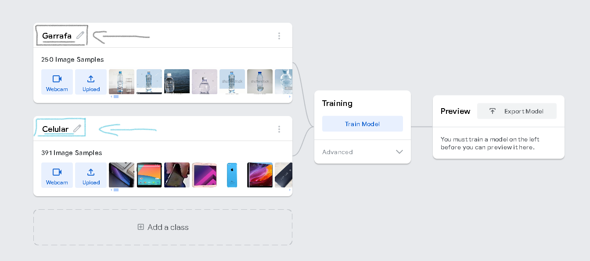

# Reconhecimento de Imagem: Garrafa vs. Celular

Este projeto utiliza aprendizado de máquina para reconhecer se uma imagem contém uma garrafa ou um celular. Foram utilizadas 250 imagens para treinar o modelo para reconhecimento de garrafas e 391 imagens para treinar o modelo para reconhecimento de celulares.


## Processo de Annotating / Labelling.

<div align="center">  
   
</div>

## Função Predict

```plaintext
// executar a imagem da webcam através do modelo de imagem
        async function predict() {
            // prever pode receber uma imagem, vídeo ou elemento de canvas html
            const prediction = await model.predict(webcam.canvas);
            for (let i = 0; i < maxPredictions; i++) {
                const classPrediction =
                    prediction[i].className +
                    ": " +
                    (prediction[i].probability * 100).toFixed(0) + "%";
                labelContainer.childNodes[i].innerHTML = classPrediction;
            }
        }
```

## Teste
[ImageModelAi.com](https://leoleoyuuki.github.io/ImageModelAi/)

## Instalação (caso queira)

Para utilizar este projeto, siga estas etapas:

1. Clone este repositório em seu ambiente local:

```plaintext
git clone https://github.com/leoleoyuuki/ImageModelAi.git
```

2. Navegue até o diretório clonado:

```plaintext
cd ImageModelAi
```


3. Abra o arquivo `index.html` em seu navegador da web.

## Utilização

Para iniciar o reconhecimento de imagem, siga estas etapas:

1. Clique no botão "Iniciar".
2. Permita que o navegador acesse sua webcam.
3. Segure um objeto (garrafa ou celular) em frente à sua webcam.
4. O sistema tentará identificar se o objeto é uma garrafa ou um celular.

## Contribuindo

Contribuições são bem-vindas! Se você deseja contribuir com este projeto, siga estas etapas:

1. Fork este repositório.
2. Crie uma nova branch com a sua funcionalidade: `git checkout -b minha-nova-funcionalidade`
3. Faça suas alterações e adicione seus commits: `git commit -m 'Adicionando uma nova funcionalidade'`
4. Envie para o branch principal: `git push origin minha-nova-funcionalidade`
5. Abra um Pull Request.
